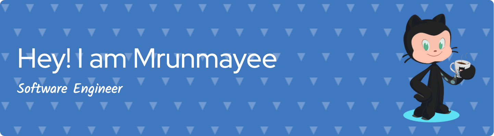

# Hi 👋 I'm Mrunmayee Bhagwat

- 🔭 I’m currently working on becoming a skilled Full Stack Developer.
- 🌱 I’m currently learning and excelling as a Software Engineer Intern, contributing to cutting-edge projects.
- 👯 I’m looking to collaborate on transformative projects in Full Stack Development.
- 🤔 I’m looking for help with exploring new opportunities and challenges in the tech industry.
- 💬 Ask me about my experience in full-stack development and automation scripting.

## About Me

Passionate about building impactful applications, I am currently a Software Engineer Intern with 4 years of experience and a graduate student pursuing an MS in Computer Science. I thrive on contributing to cutting-edge projects, honing my skills in Full Stack Development, and staying at the forefront of industry trends.

## Key Highlights

- Demonstrated prowess in full-stack development using technologies like React, Spring Boot, and Node.js.
- Proficient in developing and maintaining efficient automation scripts (WebdriverIO, Appium) resulting in a 30% reduction in manual testing efforts.
- Experienced in implementing parallel execution for automation scripts, reducing overall test suite execution time by 40%.
- Dedicated team player, driven to collaborate effectively and achieve shared goals.

## Skills

### Languages

### Environment

### Technologies/Frameworks

### DevOps

### Database

### Cloud Technologies

### Tools

## GitHub Stats

## Featured Projects

Here are some of my featured projects:

## Top Languages

## How to Reach Me

📫 Reach out to me via:

## Let's Connect! 🤝

Eager to take on new challenges and contribute to transformative projects, I am excited to connect with like-minded professionals. Let's connect and build something great together!

